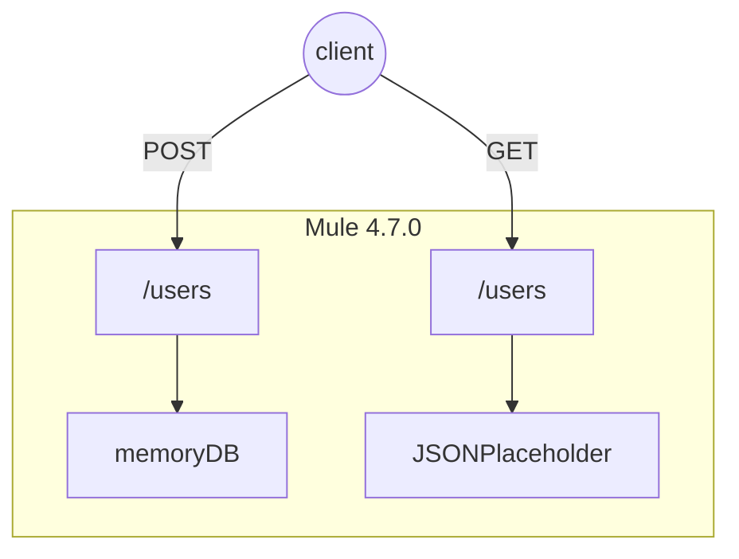

# SOHO-users-api
Repositorio con la api correspondiente a la prueba de Mulesoft

### Supuestos hechos durante el desarrollo

- La versión a usar para la realización de esta práctica será la versión de runtime 4.7.0.
- Todos los campos del usuario serán de tipo String.
- La base de datos en memoria deberá ser persistente.
    - Se usará el componente ObjectStore para lograr este punto.
- La creación del token de autorización se realizará de manera manual debido a que para configurar politicas como JWT se requiere que la api sea desplegada en cloudHub (Anypoint Plataform) y lo cual llevará a que se realicen las configuraciones en Api Manager.
    - Se realizará la configuración de un token custom usando los esquemas de seguridad configurables en el RAML.
    - Se realizará la validación de manera manual internamente en la api.
- Se realizará encriptación del token usando secure properties para seguir buenas prácticas de desarrollo y seguridad.
    - La clave de desencriptación se encuentra en el aparatado de [informacion de despliegue](#ides1).
- Se realizará una doble validación de los campos de Nombre (incluyendo los campos first_name y last_name) e Email del usuario, ya sea por campo faltante en el request o el campo vacío.
- La lista de todos los usuarios será complementada con la información de la api externa (JSONPlaceHolder) y la base de datos en memoria.
- Los mensajes de error compartirán parte del formato de los mensajes de éxito [Formato de mensajes](#fom1).

##### Diagrama de conexiones

## Connections info

| nombre                   | valor                                                        |
| ---------------------- | ------------------------------------------------------------ |
| Protocolo               | http                                      
| Host                   | localhost                                             |
| Puerto                   | 8081                                                          |
| Ruta                   | /api/users                |
| Definición RAML | [RAML](src/main/resources/api/api-users.raml) |
| Métodos                | /users  [POST]   /users [GET] |

 

## Headers

| nombre             |Descripción                                                  | requerido | Valor
| ---------------- |  ------------------------------------------------------------ | -------- | ------- |
| Authorization       | token usado para validar acceso a los metodos de la api                      | Y      | lH0QP9BhIWHmffVXV6vcXxCHtXLu1hiDUetTKEkhRwpfKdK1hyRlc6wJiG7TViS9 |

 

## Informacion de despliegue

#### Paso 1
Al momento de querer ejecutar la api se deberá configurar en los argumentos de despliegue los siguientes parámetros.
    
    -Dprop.key=SOHOTEST -Dmule.env=dev

#### Paso 2
Para el uso de cualquiera de los endpoints se deberá utilizar el token de authorización mostrado en el encabezado previo [Headers](#he1).

## Endpoints

#### /users

| metodo |  Cometido              | Request y Respuesta |
 | ------ |  -------------- | -------------------------- |
 | GET  | Devuelve lista completa de usuarios |  [[ GET RESPONSE](src/main/resources/api/Examples/Responses/Response-get-users.json)]                          |
| POST    | Creación de nuevos usuarios|  [ [ POST REQUEST](src/main/resources/api/Examples/Request/Request-users.json) ]  [[ POST RESPONSE](src/main/resources/api/Examples/Responses/Response-add-users.json)]                                             |

 

## Formato de Mensajes

#### Formato de exito
    {
        cid: uuid(),
        status: "Success",
        code: vars.httpStatus default 200,
        timestamp: now(),
        data: payload,
        error: []
    }

#### Formato de error
    {
        cid: uuid(),
        status: "Failed",
        code: vars.httpStatus default 500,
        timestamp: now(),
        data: [],
        error: error.detailedDescription
    }

## Información de responsables

| Proyecto                                    | Encargado de Proyecto | Dirigido a     | Desarollador  |
| ------------------------------------------ | -------------------- | -------------------- | ---------- |
| SOHO prueba práctica | Eliana Calderon    | SOHO | Jhonaire Flores|

